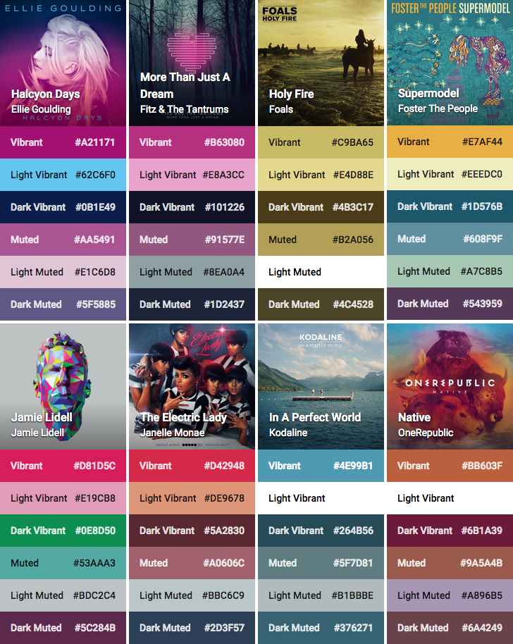

Palette for PHP
===============



**Palette** is a port of the Android library of the same name, for extracting a colour palette from an image. The
results can then be used for tinting the interface to match the image.

Installation
------------
```bash
$ composer require 'marijnvdwerf/material-palette:~1.0'
```

Usage
-----
Palette makes use of the [Intervention image library](https://github.com/Intervention/image) to load images, and supports
both the Imagick and GD drivers. The performance of the Imagick driver is slightly better, but the difference is fairly small.

```php
$manager = new ImageManager(array('driver' => 'imagick'));
$image = $manager->make('path/to/image.png');

$palette = Palette::generate($image);
echo $palette->getVibrantSwatch()->getColor();
```

Contrast
--------
You can get the contrast of a colour on a non-translucent background by calling
`AbstractColor::calculateContrast($background, $foreground)`. Information on the recommended contrast ratio can be found
at [the W3C recommendation](http://www.w3.org/TR/WCAG/#visual-audio-contrast-contrast).

```php
$white = new RGBColor(1, 1, 1);
$black = new RGBColor(0, 0, 0);
$background = $palette->getVibrantSwatch()->getColor();

echo '<div style="background: ' . $background . '">';
if(AbstractColor::calculateContrast($background, $white) >= 3) {
    echo '<h1 style="color: white;">Palette</h1>';
} else {
    echo '<h1 style="color: black;">Palette</h1>';
}
echo '</div>';
```
